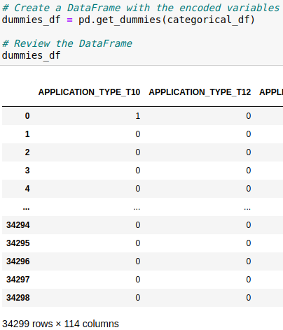
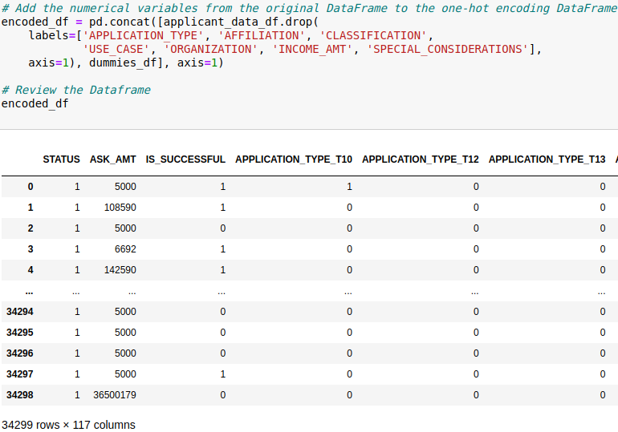
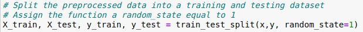
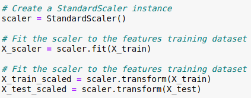
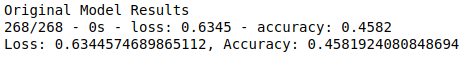
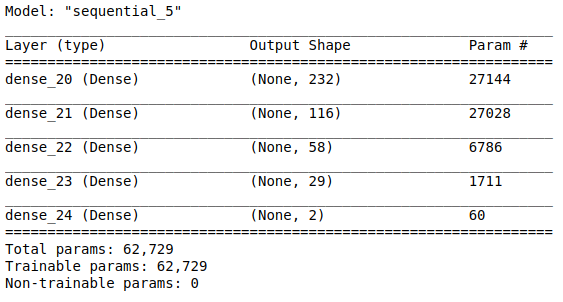
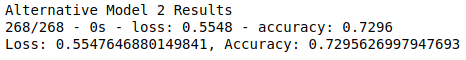
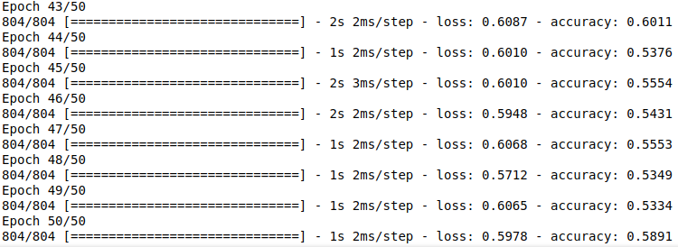
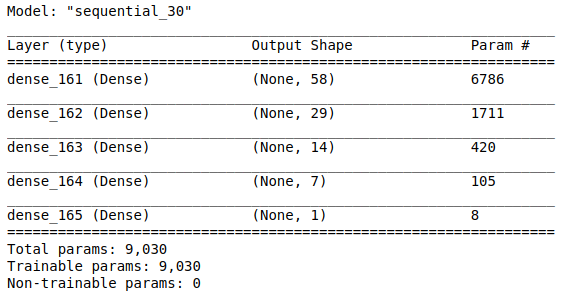
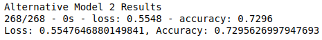

# Module 13 Deep Learning
In this module we attempt to predict the success of a start up.

### We start with some applicant data

### We then drop the irrelevant columns

### Then one-hot encode the categorical columns
\
*NOTE* The column count increased from `7` to `114`.

### Then concatenate our one-hot encoded DataFrame with our continuous variables
\
*NOTE* The column count has increased oncemore to `117`.

### Split our pre-processed data into training and testing sets

### Use scikit-learn to scale our data

### Try different model architectures
*Model 1*\

\
Yikes.

*Model 2*\

\
Better but, what's up with that first layer? I mean, the whole idea here is to abstract features from your data, which intutively involves reducing the amount of information. Odd.\

## The realization
*Model 3*\
Yes, really, I tried *30* times. I noticed as the previous model was training that it was barely better than a coin flip.\ 
\
I thought this was odd, so while, I don't have a picture to show my results, I trained a model with the output layer to `Dense(units=4)`. The accuracy was horrendous. *Then it hit me*. What if I was using the wrong number of neurons in the output layer? I assumed two outputs because binary could be `1` or `0`. So I tried the output layer set to `Dense(units=1, activation='sigmoid')`.\
\
And got this\
\

The output for a binary classification model should be a single neuron. It's activation value tells you `1` success or `0` fail.